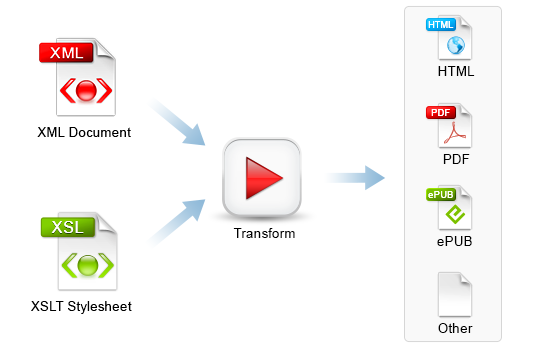

Université de Neuchâtel
Master en littérature

# Édition critique et génétique numérique

Élodie Paupe, chargée d'enseignement
elodie.paupe@unine.ch

---
 
# L'exemple des lettres de Vincent Van Gogh

--- 


Leo Jansen, Hans Luijten, Nienke Bakker (eds.) (2009), _Vincent van Gogh - The Letters_. Amsterdam & The Hague: Van Gogh Museum & Huygens ING. http://vangoghletters.org/vg/letters/let001/letter.html.

---

## Derrière le site web

* Une édition basée sur des fichiers XML encodés selon un schéma personnalisé qui respecte les stardards de la TEI. 
* Un fichier XML-TEI par lettre qui contient: 
    * des métadonnées
    * les liens vers les facsimilés
    * la transcription de la lettre
    * la traduction 
    * les notes
* Transformation de ces fichiers XML-TEI en pages HTML pour permettre la lecture. 

---


[Fichier 1](exemples/let001.xml)


--- 


---


https://www.oxygenxml.com/xml_editor/xslt_transformation.html

---
### Une solution pour la visualisation:  http://v-machine.org 
* une chaîne de traitement complète 
    * normes d'édition numériques XML-TEI à respecter
    * fichier XSLT qui permet la transformation d'un document correctement formé en page HTML
    * fichier CSS qui permet la visualisation dynamique de l'édition
* pour réaliser l'édition, il faut un éditeur de texte capable d'exécuter une feuille de style XSLT: Oxygen est recommandé.

---

## XML-TEI

---
### Qu'est-ce que le XML?

X _Extensible_
M _markup_
L _Language_

* Un (méta)langage de balisage
* 1996: premiers travaux 
* 1998: XML 1.0 
* Objectif: permettre l'interopérabilité

---
Autrement dit: 
* Pas un langage de programmation: un document XML n'exécute aucune fonction.
* Un langage qui sert à ajouter des métadonnées sur un contenu qui n'est pas mis en forme = un langage informatique de représentation des données.
* Un langage ouvert (= extensible) qui peut s'adapter aux besoins de l'utilisateur.

---

### Concept de base

Transformer un texte brut (= une chaîne de caractères) en base de données à l'aide d'un langage informatique (= XML) qui isole des portions de texte (= sous-chaînes de caractères) en fonction des informations que l'éditeur souhaitent mettre en évidence.

---

### Structuration d'un texte brut

Il faut penser le texte comme une architecture:
* livre
    * chapitres
        * paragraphes
            * phrases
                * mots
                    * caractères

--- 


---

 

---
```
<livre>
    <chapitre>
        <paragraphe>
            <phrase>
                <mots>
                    <caractère>
                        A
                    </caractère>
                    <caractère>
                        V
                    </caractère>
                    <caractère>
                        E
                    </caractère>
                </mot>
                <mot>popule</mot>
            </phrase>
            <phrase> </phrase>
        </paragraphe>
        <paragraphe> </paragraphe>
    </chapitre>
    <chapitre> </chapitre>
</livre>
```

---
### TEI 

* Problème du XML: pas de standards communs
* Pour l'encodage de texte, développement d'une pratique commune à travers 

T = _Text_
E = _Encoding_
I = _Initiative_

---

* Version standardisée du XML pour représenter un texte sous une forme numérique:

    > The Text Encoding Initiative (TEI) is a consortium which collectively develops and maintains a standard for the representation of texts in digital form. Its chief deliverable is a set of Guidelines which specify encoding methods for machine-readable texts, chiefly in the humanities, social sciences and linguistics.

* Recommandations émises par un consortium: 
    > The TEI Consortium is a nonprofit membership organization composed of academic institutions, research projects, and individual scholars from around the world.

Source: https://tei-c.org 

--- 

### XML et TEI

* La TEI est donc une normalisation du langage XML utilisée par une communauté. 
* Cette normalisation implique d'utiliser les balises définies par les guidelines établies et continuellement mises à jours.
* Il existe des balises standardisées pour encoder la génétique d'un texte. 

[Guidelines: Representations of Primary Sources](https://tei-c.org/release/doc/tei-p5-doc/en/html/PH.html#PH-changes)

---


---

## Encoder en XML-TEI

---

## Fonctionnement de base

Ce langage de balisage fonctionne de manière simple
```XML
    <élément attribut="valeur">données</élément>
```
---

1. Les données sont la chaîne de caractères (= le texte brut).
1. On appelle "balise" les `<élément>` qui sont toujours écrits entre chevrons.
1. Une `<balise>` s'ouvre et doit impérativement être fermée `</balise>`
1. Des balises ne peuvent pas se chevaucher, c'est le principe des poupées russes: 
    - Correct: `<baliseA>` `<baliseB>` données `</baliseB>` `</baliseA>`
    - Fautif: `<baliseA>` `<baliseB>` données  `</baliseA>` `</baliseB>`
1. Une `<balise/>` peut être auto-fermante: elle ne contient donc pas de données.
1. Un `<élément>` peut porter un `@attribut` (noté avec un `@`) 
1. L’`@attribut` a une "valeur" (entre guillemets)
    - `<élément @="valeur de l'attribut">`

--- 

## Texte en vers
[Guidelines TEI pour la versification](https://www.tei-c.org/release/doc/tei-p5-doc/en/html/VE.html)

---
### Strophe/groupe de vers `lg` et vers `l`

```XML
<head>Mon rêve familier</head>  
    <lg>
        <l n="1">Je fais souvent ce rêve étrange et pénétrant</l>
        <l n="2">D'une femme inconnue, et que j'aime, et qui m'aime</l>
        <l n="3">Et qui n'est, chaque fois, ni tout à fait la même</l>
        <l n="4">Ni tout à fait une autre, et m'aime et me comprend.</l>
    </lg>
```
--- 
### Saut de ligne `lb`


```XML
<lg>
  <l>Ceulx qui sont mesdisans, se plairont à mesdire,</l>
  <l>Ceulx  qui sont moins fascheux, diront des mots pour <lb/>[rire,</l>
  <l>Ceulx qui sont plus vaillans, vanteront leur valeur:</l>
</lg>
```

---

## Encoder la création

Les étapes de l'écriture (rature, d'ajouts, repentences…) sont encodées avec les balises suivantes

* `<del>` permet d'encoder un passage effacé
* `<add>` permet d'encoder un passage ajouté


```xml
Mon <del>cher</del><add>vieil</add> ami
```

---

## Niveaux de réécriture

En TEI, on considère que le processus de réécriture s'encode de la même manière que la variante textuelle entre témoins d'un même texte. On utilise donc l'élément `<app>` pour introduire une variation et l'élément `<rdg>` pour renseigner chaque variante de réécriture. L'attribut `@wit` identifie la leçon. 

```xml
<l n="2">
    <app>
        <rdg wit="#t7989-1-2">Afraid, aware, little</rdg>
        <rdg wit="#t7989-1-3 #t7989-1-1 #nocturne_poems">Alone, self-conscious, frightened,</rdg>
    </app>
    <app>
        <rdg wit="#t7989-1-2"><add rend="hand">blundering,</add></rdg>
        <rdg wit="#t7989-1-3 #t7989-1-1 #nocturne_poems">blundering;</rdg>
    </app>
    <app>
        <rdg wit="#t7989-1-2"> lonely thing:</rdg>
    </app>
</l>
```

---


---

### Liste des versions
Selon Versioning Machine, les différentes versions du texte qui sont assemblées dans l'édition génétique sont listées grâce à l'élément `<witList>`.

```xml
<witList>
    <witness xml:id="t7989-1-2">'Nocturne, Saint Eloi, 1918' (TCD 878/1/2)</witness>
    <witness xml:id="t7989-1-3">'Nocturne of St. Eloi, 1918' (TCD MS 7989/1/3)</witness>
    <witness xml:id="t7989-1-1">'Nocturne, Saint Eloi' (TCD MS 79891/1/1)</witness>
    <witness xml:id="nocturne_poems">This poem was published in <title>Poems</title> as 'Nocturne'</witness>
</witList>
```

--- 

## <teiHeader> et métadonnées


---
### Sources

Burnard, Lou, "La TEI et le XML" in: _Qu’est-ce que la Text Encoding Initiative?_ [en ligne], Marseille: OpenEdition Press, 2015. Disponible sur Internet : <http://books.openedition.org/oep/1298>. DOI : https://doi.org/10.4000/books.oep.1237.

Gabay, Simon (éd.), _Encoder, Analyser - Introduction à la philologie numérique_, Genève: Université de Genève, 2020, [https://github.com/gabays/Cours_Edition_Geneve](https://github.com/gabays/Cours_Edition_Geneve).
