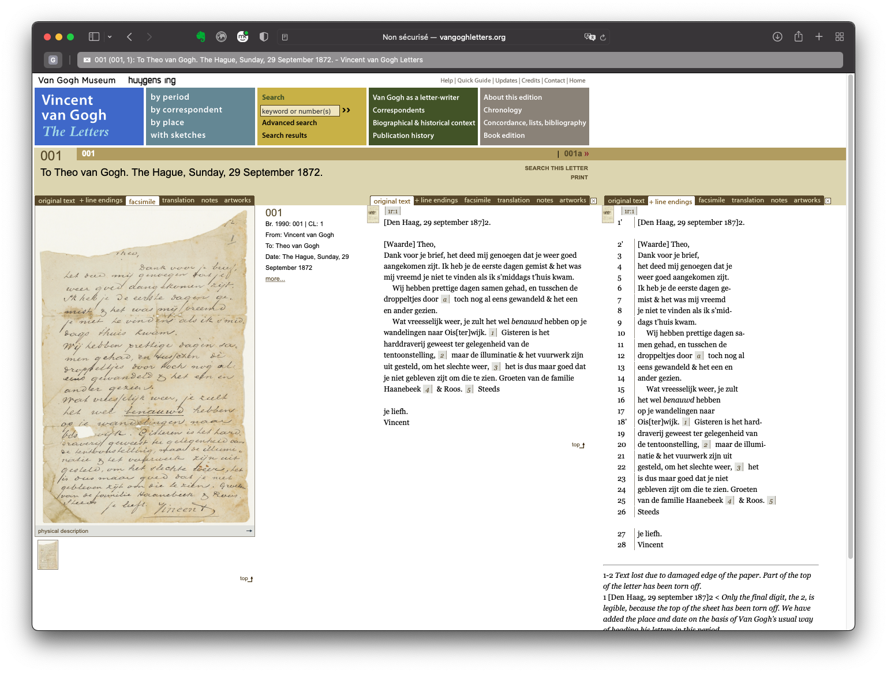
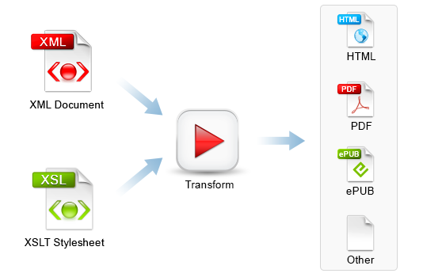

Université de Neuchâtel
Master en littérature

# Édition critique et génétique numérique

Élodie Paupe, chargée d'enseignement
elodie.paupe@unine.ch

---
 
# L'exemple des lettres de Vincent Van Gogh

--- 



Leo Jansen, Hans Luijten, Nienke Bakker (eds.) (2009), _Vincent van Gogh - The Letters_. Amsterdam & The Hague: Van Gogh Museum & Huygens ING. http://vangoghletters.org/vg/letters/let001/letter.html.

---

## Derrière le site web

* Une édition basée sur des fichiers XML encodés selon un schéma personnalisé qui respecte les stardards de la TEI. 
* Un fichier XML-TEI par lettre qui contient: 
    * des métadonnées
    * les liens vers les facsimilés
    * la transcription de la lettre
    * la traduction 
    * les notes
* Transformation de ces fichiers XML-TEI en pages HTML pour permettre la lecture. 

---


[Fichier 1](exemples/let001.xml)


--- 


---


https://www.oxygenxml.com/xml_editor/xslt_transformation.html

---
### Une solution pour la visualisation:  http://v-machine.org 
* une chaîne de traitement complète 
    * normes d'édition numérique XML-TEI à respecter
    * fichier XSLT qui permet la transformation d'un document correctement formé en page HTML
    * fichiers CSS et JSON qui permet la visualisation dynamique de l'édition
* pour réaliser l'édition, il faut un éditeur de texte capable d'exécuter une feuille de style XSLT: Oxygen est recommandé.

---

## XML-TEI

---
### Qu'est-ce que le XML?

X _Extensible_
M _markup_
L _Language_

* Un (méta)langage de balisage
* 1996: premiers travaux 
* 1998: XML 1.0 
* Objectif: permettre l'interopérabilité

---
Autrement dit: 
* Pas un langage de programmation: un document XML n'exécute aucune fonction.
* Un langage qui sert à ajouter des métadonnées sur un contenu qui n'est pas mis en forme = un langage informatique de représentation des données.
* Un langage ouvert (= extensible) qui peut s'adapter aux besoins de l'utilisateur.

---

### Concept de base

Transformer un texte brut (= une chaîne de caractères) en base de données à l'aide d'un langage informatique (= XML) qui isole des portions de texte (= sous-chaînes de caractères) en fonction des informations que l'éditeur souhaitent mettre en évidence.

---

### Structuration d'un texte brut

Il faut penser le texte comme une architecture:
* livre
    * chapitres
        * paragraphes
            * phrases
                * mots
                    * caractères

--- 


---

 

---
```XML
<livre>
    <chapitre>
        <paragraphe>
            <phrase>
                <mots>
                    <caractère>
                        A
                    </caractère>
                    <caractère>
                        V
                    </caractère>
                    <caractère>
                        E
                    </caractère>
                </mot>
                <mot>popule</mot>
            </phrase>
            <phrase> </phrase>
        </paragraphe>
        <paragraphe> </paragraphe>
    </chapitre>
    <chapitre> </chapitre>
</livre>
```

---
### TEI 

* Problème du XML: pas de standards communs
* Pour l'encodage de texte, développement d'une pratique commune à travers 

T = _Text_
E = _Encoding_
I = _Initiative_

---

* Version standardisée du XML pour représenter un texte sous une forme numérique:

    > The Text Encoding Initiative (TEI) is a consortium which collectively develops and maintains a standard for the representation of texts in digital form. Its chief deliverable is a set of Guidelines which specify encoding methods for machine-readable texts, chiefly in the humanities, social sciences and linguistics.

* Recommandations émises par un consortium: 
    > The TEI Consortium is a nonprofit membership organization composed of academic institutions, research projects, and individual scholars from around the world.

Source: https://tei-c.org 

--- 

### XML et TEI

* La TEI est donc une normalisation du langage XML utilisée par une communauté. 
* Cette normalisation implique d'utiliser les balises définies par les guidelines établies et continuellement mises à jours.
* Il existe des balises standardisées pour encoder la génétique d'un texte. 

---


---

## Encoder en XML-TEI

---

## Fonctionnement de base

Ce langage de balisage fonctionne de manière simple

```XML
    <élément attribut="valeur">données</élément>
```
---

1. Les données sont la chaîne de caractères (= le texte brut).
1. On appelle "balise" les `<élément>` qui sont toujours écrits entre chevrons.
1. Une `<balise>` s'ouvre et doit impérativement être fermée `</balise>`
1. Des balises ne peuvent pas se chevaucher, c'est le principe des poupées russes: 
    - Correct: `<baliseA>` `<baliseB>` données `</baliseB>` `</baliseA>`
    - Fautif: `<baliseA>` `<baliseB>` données  `</baliseA>` `</baliseB>`
1. Une `<balise/>` peut être auto-fermante: elle ne contient donc pas de données.
1. Un `<élément>` peut porter un `@attribut` (noté avec un `@`) 
1. L’`@attribut` a une "valeur" (entre guillemets)
    - `<élément @="valeur de l'attribut">`

--- 
## Structure minimale d'un fichier XML-TEI
Pour être dit "bien formé", un fichier XML-TEI doit respecter la syntaxe XML et les _guidelines_ de la TEI.
Au minimum, un fichier XML-TEI se compose: 
* d'un élément racine `<TEI>` qui contient l'entier du fichier
* d'un `<teiHeader>` qui contient les métadonnées du fichier dans une balise `<fileDesc>`
* d'un corps de texte compris dans la balise `<body>` elle-même comprise dans uen balise `<text>`

---

```XML
<?xml version="1.0" encoding="UTF-8"?>
<TEI xmlns="http://www.tei-c.org/ns/1.0">
  <teiHeader>
      <fileDesc>
         <titleStmt>
            <title>Mon édition numérique</title>
         </titleStmt>
         <publicationStmt>
            <p>Élodie Paupe, Université de Neuchâtel. Cours d'édition, semestre d'automne 2020</p>
         </publicationStmt>
         <sourceDesc>
            <p>Le(s) manuscrit(s) de l'édition</p>
         </sourceDesc>
      </fileDesc>
  </teiHeader>
  <text>
    <body>
        <p>Texte</p>
    </body>
  </text>
</TEI>
```

--- 

## Texte en vers
[Guidelines TEI pour la versification](https://www.tei-c.org/release/doc/tei-p5-doc/en/html/VE.html)


---
### Strophe/groupe de vers `lg` et vers `l`

```XML
<head>Mon rêve familier</head>  
    <lg>
        <l n="1">Je fais souvent ce rêve étrange et pénétrant</l>
        <l n="2">D'une femme inconnue, et que j'aime, et qui m'aime</l>
        <l n="3">Et qui n'est, chaque fois, ni tout à fait la même</l>
        <l n="4">Ni tout à fait une autre, et m'aime et me comprend.</l>
    </lg>
```
--- 
### Saut de ligne `lb`


```XML
<lg>
  <l>Ceulx qui sont mesdisans, se plairont à mesdire,</l>
  <l>Ceulx  qui sont moins fascheux, diront des mots pour <lb/>[rire,</l>
  <l>Ceulx qui sont plus vaillans, vanteront leur valeur:</l>
</lg>
```

---

[Exercice 1](exercices/exo1_LePontMirabeau.xml) : 
* Encoder le poème manuscrit en ajoutant les balises `<head>` pour le titre `<lg>` pour les strophes et `<l>` pour les vers. 
* Numéroter les strophes et les vers avec l'attribut `@n="..."`. 

Corrigé [ici](exercices/corr1_LePontMirabeau.xml)

---

## Encoder la création
[Guidelines: Representations of Primary Sources](https://tei-c.org/release/doc/tei-p5-doc/en/html/PH.html#PH-changes)

---
### Suppressions et ajouts

Les étapes de l'écriture (rature, d'ajouts, repentences…) sont encodées avec les balises suivantes

* `<del>` permet d'encoder un passage effacé
* `<add>` permet d'encoder un passage ajouté


```xml
Mon <del>cher</del><add>vieil</add> ami
```

---

### Liste des témoins
Pour être interprétés correctement par les fichiers de Versioning Machine, les différentes versions du texte qui sont assemblées dans l'édition génétique sont listées grâce à l'élément `<witList>` dans le `<font>` du document XML. 

Chaque témoin est identifié avec un `@xml:id` unique vers lequel pointent les balises `<rdg wit="#...">`. 

```xml
<witList>
    <witness xml:id="t7989-1-2">'Nocturne, Saint Eloi, 1918' (TCD 878/1/2)</witness>
    <witness xml:id="t7989-1-3">'Nocturne of St. Eloi, 1918' (TCD MS 7989/1/3)</witness>
    <witness xml:id="t7989-1-1">'Nocturne, Saint Eloi' (TCD MS 79891/1/1)</witness>
    <witness xml:id="nocturne_poems">This poem was published in <title>Poems</title> as 'Nocturne'</witness>
</witList>
```

---

### Niveaux de réécriture

On utilise donc l'élément `<app>` pour introduire une variation et l'élément `<rdg>` pour renseigner chaque variante de réécriture. L'attribut `@wit` identifie le témoin. 

```xml
<l n="1">Sous le pont 
    <app>
        <rdg wit="#LePontMirabeau">Mirabeau</rdg>
        <rdg wit="#tNAF_25604-25635">mirabeau</rdg>
    </app> 
    coule la
    <app>
        <rdg wit="#LePontMirabeau">Seine</rdg>
        <rdg wit="#tNAF_25604-25635">Seine.</rdg>
    </app>
</l>
```

---


---

[Exercice 2](exercices/exo2_LePontMirabeau.xml) : 
* Encoder quelques variations avec `<app>` et `<rdg>` l'attribut `@wit="..."`. 
* Encoder les corrections avec `<del>` et `<corr>`. 

Corrigé [ici](exercices/corr2_LePontMirabeau.xml)

---

# Versioning machine 5.0

---

* Les normes d'encodage présentées sont décrites dans [documentation.html](v-machine/documentation.html) et le schéma `vmachine.rng` contrôle que votre document soit bien formé. Pour cela, il faut le lier à votre document XML en ajoutant les lignes suivantes au début du fichier: 

```XML
<?xml version="1.0" encoding="UTF-8"?>
<?xml-model href="../schema/vmachine.rng" type="application/xml" schematypens="http://relaxng.org/ns/structure/1.0"?>
<?xml-model href="../schema/vmachine.rng" type="application/xml" schematypens="http://purl.oclc.org/dsdl/schematron"?>
<TEI xmlns="http://www.tei-c.org/ns/1.0">
...
</TEI>
```

Sous `@href` se trouve le chemin relatif dans l'arborescence de votre ordinateur qui lit votre document XML au schéma `.rng`.

---


---


---

* Une fois que vous avez un fichier XML bien formé, vous devez le transformer en fichier HTML pour qu'il puisse être visualisé. Pour cela, vous allez utiliser le fichier XSLT fourni dans la documentation de Versioning Machine 5.0; [vmachine.xsl](v-machine/src/vmachine.xsl)

Voyons comment faire grâce à Oxygen, pas à pas. 

---
1. Lier le fichier XSL au fichier XML dans Oxygen en cliquant sur l'épingle verte et en sélectionnant le fichier. 
La déclaration `<?xml-stylesheet type="text/xsl" href="../src/vmachine.xsl"?>` s'ajoute en haut de votre document, sous les déclarations de schéma. 

---


---

2. Créer le scénario de transformation en pressant sur la clé à outil et sélectionner "nouveau" --> "XML transformation with XSLT". 

---


---

3. Donner un nom au scénario. 
4. Sous XSLT, renseigner le chemin vers le fichier XML (celui que vous souhaitez transformer) et vers le fichier XLS (`vmachine.xsl`)

---


---

5. Sous sortie, choisir l'endroit où enregistrer le fichier et lui donner un nom. 
Pour simplifier les choses, nous allons enregistrer le fichier dans le dossier "sample" de Versioning Machine 5.0 et nommer le fichier avec une extension en `.html`.

Cela signifie que nos deux fichiers XML et HTML sont enregistrés au même endroit.

---


---

6. Cliquer sur "ok" puis sur "Appliquer le/les scénario(s) associé(s)"
7. Un fichier `.html` apparaît dans le bas de l'écran et se trouve enregistré dans le dossier "sample". 

---


---

8. Ouvrir le document dans Google Chrome. 
9. Ouvrir le document dans Oxygen. 

---

# Sources

---

Burnard, Lou, _Qu’est-ce que la Text Encoding Initiative?_ [en ligne], Marseille: OpenEdition Press, 2015. Disponible sur Internet : <http://books.openedition.org/oep/1298>. DOI : https://doi.org/10.4000/books.oep.1237.

[Versioning Machine 5.0](http://v-machine.org/), by Lara Vetter, Maryland Institute for Technology in the Humanities, Summer 2003; Jarom McDonald, Maryland Institute for Technology in the Humanities, January 2005; Sean Daugherty, University of Maryland Libraries, November 2006, March 2007, and July 2007; Tanya Clement, Digital Cultures and Creativity, University of Maryland and Susan Schreibman, Digital Humanities Observatory, June 2010; and Roman Bleier and Joshua D. Savage, An Foras Feasa at the Maynooth University Institute for the Humanities, 2015.
